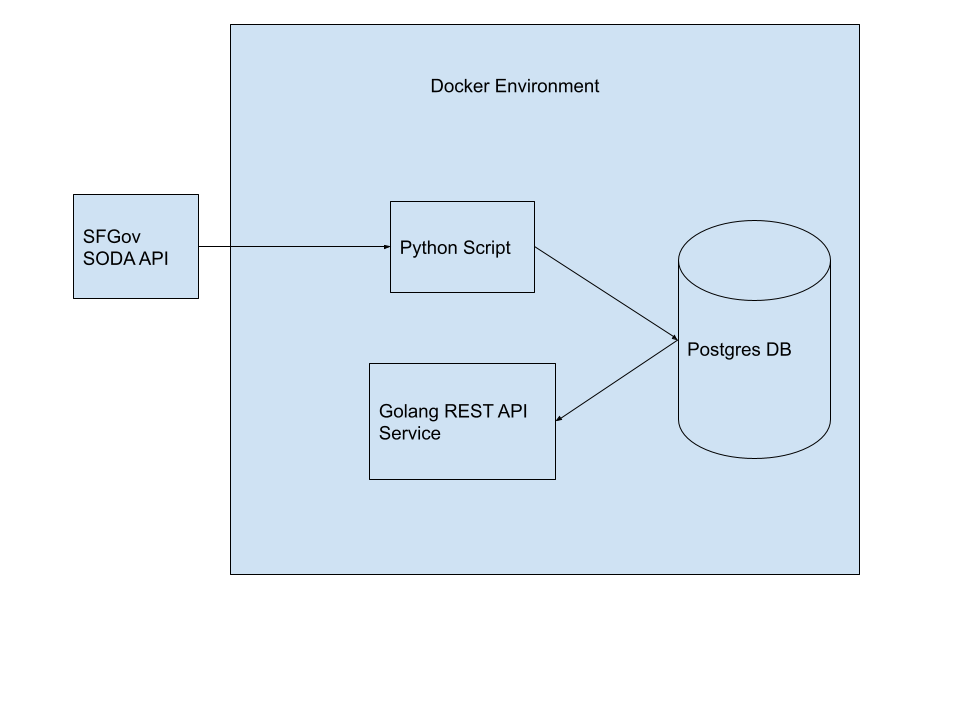

# About The Project

This Application is a Golang REST API Service that provides San Francisco food trucks data. This data comes from the [dataSF API](https://data.sfgov.org/resource/rqzj-sfat.json). I have built a Python script that process and ingests this data from the SFGov API into a Postgres database. The purpose of this application is to build the foundation for a complete backend service that is based around sf food trucks data. 

# Setup

## Get Started
Running this Application requires Docker. For more info on setting up Docker  [Click Here](https://docs.docker.com/get-docker/)

This whole application can be run in Docker using the make `start-services` command. Running this command will spin up a Postgres DB. The necessary database migrations will be executed using sql-migrate. This will create the food_trucks table. Next a Golang Rest API Service will be spun up  and finally the Python script executed. The Postgres DB, Golang Service and Python Script are all in separate containers.
## To Run services
```bash
make start-services
```

### The rest of the setup is for manually setting up the Golang and Python components of the services. It is not required.

## Golang manual setup
Running this script requires Golang. For more info on setting up  [Click Here](https://go.dev/doc/install)
### 1. SQL Migrate (Required)
SQL Migrate is used for running migrations inside ./db/migrations folder

To install the library and command line program, use the following:

```bash
go get -v github.com/rubenv/sql-migrate/...
```
### 2. gorilla/mux (Required)

```bash
go get github.com/gorilla/mux
```
### 3. godotenv (Required)

```bash
go get github.com/joho/godotenv
```
### 4. Run Golang Service
```bash
make run
```

## Manual Run Python Script
Running this script requires Python (Python 3+). For more info on setting up  [Click Here](https://www.python.org/downloads/)
### 1. Install python requirements
```bash
pip3 install -r ./python_script/requirements.txt
```
### 2. Run python script
At the root of project
```bash
python ./python_script/import_data.py
```

## Testing
### To run Unit Tests
```bash
make test
```
# Dev notes

Plan of action:
I will be building a python script that will integrate with the sf food_trucks api. The python script will process data and insert the data into a postgres database. I will then build a golang rest api server that will serve food trucks data.

Architecture Decision #1 
I will be using Postgres for the database because it is something i am familiar with, it is a popular relational database solution that is tried and tested. Postgres is capable of serving the needs of this service and is flexible to future needs of this app.

Architecture Decision #2
I will be using Docker to containerize the python script, golang rest api service and the postgres database. This will make it easier for developers to run this app in their own environment as well as online. Docker will provide many benefits easy deployment, isolation, scalability, flexibility and more.

Architecture Decision #3
I will be using python to create a script of ingesting the data from the sfgov SODA API and inserting it to the database. I'm choosing python because its very easy to quickly write a script that will handle this use case.

Architecture Decision #4 
I will be using golang to create the rest api server. I'm choosing golang because it's something that i'm comfortable with and used recently to build a rest api service. Golang is a highly performant compiled language. 

# System Diagram


# Features to be Added
- Create Users
    - Sign up and Log in Functionality.
- Add Ratings and Reviews Functionality
    - Add end API for users to leave a rating and reviews for the restaurants.
- Add a near me API
    - This API will return a list of restaurants that is close to user's provided address.
- Food Trucks Filter
    - Add filtering to food_items field.
